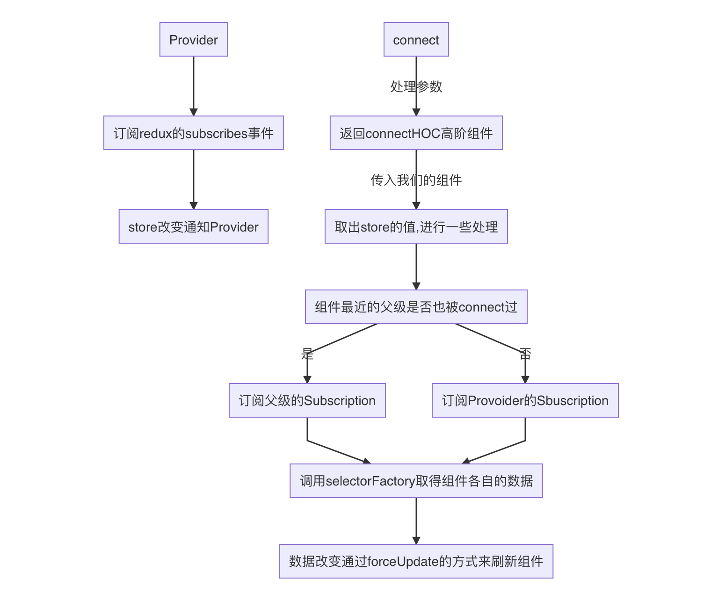

#React-Redux 源码阅读笔记
## 原理简述

在分析源码之前，需要先将`react-redux`的原理简述一下，否则光干看代码还是会比较懵

先简单的画一个流程



`react-redux`的核心机制是通知订阅模式，源码中有一个`Subscription`类，它的作用主要是订阅父级的更新和通知子级的更新，也就是它既可以订阅别人，别人也可以订阅它，同时可以通知订阅它的`Subscription`

最外层的`Provider`组件的`Context`里包含了的`store`（也就是我们传入的）和生成的`Subscription`实例，它的`Subscription`实例订阅的则是`redux` 的`subscrib()`

当我们使用了`connect()`时，它会生成一个新组件`<Component1/>`，`<Component1/>`里会生成一个`Subscription`实例，它会订阅父级（这时是`Provider`）的`Subscription`实例，同时将自己的`Subscription`覆盖进`Context`，再包装我们传入的组件，如下模式

```jsx
// overriddenContextValue包含了新组件的Subscription实例和store
<Component1.Provider value={overriddenContextValue}>
  {WrappedComponent}
</Component1.Provider>
```

如果在`<Component1/>`里的子组件又有`connect()`，那么生成的`<Component2/>`组件的`Subscription`实例会订阅父级`<Component1/>`的`Subscription`实例，同时再将自己的`Subscription`覆盖进`Context`

 在组件挂载完成后，如果`store`有更新，`Provider`会通知下一级组件的`Subscription`，下一级组件又回通知自己的下一级组件

```jsx
<Provider store={store}>
  <Component1> // 它订阅的Provider
  	<Component2/> // 它订阅的Component2
  <Component1/>
</Provider>
// 当store有更新，Provider通知Component1，Component1通知Component2
```

在订阅的时候，会将更新自己组件的方法通过回调`onStateChange()`传入父级的`Subscription`

一旦父级接收到通知，就会循环调用订阅自己的组件的`onStateChange`来更新它们

更新的原理就是使用我们传入的`mapStateToProps`和`mapDispatchToProps`，结合内置的`selectorFactor()`来对比`state`和`props`，一旦有改变就强制更新自己，所以我们传入的`WrappedComponent`也被强制更新了

原理简单来讲就是这样，下面来看源码

## 源码简析

在顺着流程分析之前，先看看贯通整个`react-redux`更新流程的`Subscription`类

### Subscription

```javascript
// Subscriotion.js
const nullListeners = { notify() {} };

// 监听集合是一个双向链表
function createListenerCollection() {
  // 也就是React里的unstable_batchedUpdates
  // 来自司徒正美微博：unstable_batchedUpdates会把子组件的forceUpdate干掉，防止组件在一个批量更新中重新渲染两次
  const batch = getBatch();
  let first = null;
  let last = null;

  return {
    clear() {
      first = null;
      last = null;
    },

    // 通知订阅者更新
    notify() {
      batch(() => {
        let listener = first;
        while (listener) {
          // 这个callback的本质就是让组件本身forceUpdate
          listener.callback();
          listener = listener.next;
        }
      });
    },

    // 订阅
    subscribe(callback) {
      let isSubscribed = true;
      // 把last赋值为新的
      let listener = (last = {
        callback,
        next: null,
        prev: last
      });

      // 如果存在前一个，就把前一个的next指向当前（最后一个）
      if (listener.prev) {
        listener.prev.next = listener;
      } else {
        // 否则它就是第一个
        first = listener;
      }

      // 返回退订函数
      return function unsubscribe() {
      	// ...退订逻辑
      };
    }
  };
}

export default class Subscription {
  constructor(store, parentSub) {
    // redux store
    this.store = store;
    // 父级的Subscription实例
    this.parentSub = parentSub;
    // 退订函数
    this.unsubscribe = null;
    // 监听者
    this.listeners = nullListeners;

    this.handleChangeWrapper = this.handleChangeWrapper.bind(this);
  }

  // 添加嵌套的订阅者
  addNestedSub(listener) {
    // 首先先将当前的Subscription实例绑定到父级
    // 绑定的同时会初始化listeners
    this.trySubscribe();
    return this.listeners.subscribe(listener);
  }

  // 通知子级
  notifyNestedSubs() {
    this.listeners.notify();
  }

  // 当父级Subscription的listeners通知时调用
  handleChangeWrapper() {
    // 这个是new出实例的时候加上的，感觉有点秀
    if (this.onStateChange) {
      this.onStateChange();
    }
  }

  trySubscribe() {
    // 不会重复绑定
    if (!this.unsubscribe) {
      this.unsubscribe = this.parentSub
        ? this.parentSub.addNestedSub(this.handleChangeWrapper)
        : // subscribe是redux里的方法，在redux state改变的时候会调用
          this.store.subscribe(this.handleChangeWrapper);
      // 创建新的listeners，每个connect的组件都会有listeners
      this.listeners = createListenerCollection();
    }
  }

  // 退订
  tryUnsubscribe() {
    if (this.unsubscribe) {
      this.unsubscribe();
      this.unsubscribe = null;
      this.listeners.clear();
      this.listeners = nullListeners;
    }
  }
}
```


省略了一些代码，`Subscription`类主要就是创建一个既有监听功能又有订阅功能的对象

接下来就顺着流程来逐步分析，首先先看`Provider`里实现了什么

### Provider

```jsx
// components/Provider.js

function Provider({ store, context, children }) {
  // useMemo仅在store变化时再重新返回
  const contextValue = useMemo(() => {
    const subscription = new Subscription(store);
    // 通知订阅这个subscription的子级刷新
    subscription.onStateChange = subscription.notifyNestedSubs;
    return {
      store,
      // 将此subscription传入context方便子级订阅
      subscription
    };
  }, [store]);

  // 缓存上次的state
  const previousState = useMemo(() => store.getState(), [store]);

  useEffect(() => {
    const { subscription } = contextValue;
    // 在这里是订阅的reudx store的subscribe事件
    subscription.trySubscribe();
    if (previousState !== store.getState()) {
      subscription.notifyNestedSubs();
    }
    return () => {
      subscription.tryUnsubscribe();
      subscription.onStateChange = null;
    };
  }, [contextValue, previousState, store]);

  // 传入的context或者react-redux自带的
  const Context = context || ReactReduxContext;

  return <Context.Provider value={contextValue}>{children}</Context.Provider>;
}
```

`Provider`是一个比较简单的组件，主要做了2件事

- 订阅`redux`的`subscribe()`事件
- 将`Subscription`实例传入`Context`方便子级订阅

接下来看看核心`connect`组件

### connect

```javascript
// connect.js

// 遍历执行函数，将arg作为参数传入，如果有结果则return
function match(arg, factories, name) {
  for (let i = factories.length - 1; i >= 0; i--) {
    const result = factories[i](arg);
    if (result) return result;
  }
  　// ... error
}

// ...

export function createConnect({
  // 默认值
  connectHOC = connectAdvanced,
  mapStateToPropsFactories = defaultMapStateToPropsFactories,
  mapDispatchToPropsFactories = defaultMapDispatchToPropsFactories,
  mergePropsFactories = defaultMergePropsFactories,
  selectorFactory = defaultSelectorFactory
} = {}) {
  return function connect(
    mapStateToProps,
    mapDispatchToProps,
    mergeProps,
    {
      pure = true,
    	// ...省略一些参数
    } = {}
  ) {
    const initMapStateToProps = match(
      mapStateToProps,
      mapStateToPropsFactories,
      "mapStateToProps"
    );
    const initMapDispatchToProps = match(
      mapDispatchToProps,
      mapDispatchToPropsFactories,
      "mapDispatchToProps"
    );
    const initMergeProps = match(mergeProps, mergePropsFactories, "mergeProps");
    return connectHOC(selectorFactory, {
      initMapStateToProps,
      initMapDispatchToProps,
      initMergeProps,
      // ...省略了一些options
    });
  };
}

export default /*#__PURE__*/ createConnect();
```

`connect()`其实是由`createConnect()`默认创建出来的，虽然我们也可以调用`createConnect()`创建自定义的`connect()`，但是基本用不上

可以看到我们传入的`mapStateToProps`，`mapDispatchToProps`、`mergeProps`实际上是通过了一个`match()`函数的包装校验

这里就以`mapStateToPropsFactories`也就是`defaultMapStateToPropsFactories`为例

#### mapStateToPropsFactories

```javascript
// mapStateToProps.js

import { wrapMapToPropsConstant, wrapMapToPropsFunc } from "./wrapMapToProps";

export function whenMapStateToPropsIsFunction(mapStateToProps) {
  return typeof mapStateToProps === "function"
    ? wrapMapToPropsFunc(mapStateToProps, "mapStateToProps")
    : undefined;
}

export function whenMapStateToPropsIsMissing(mapStateToProps) {
  return !mapStateToProps ? wrapMapToPropsConstant(() => ({})) : undefined;
}

export default [whenMapStateToPropsIsFunction, whenMapStateToPropsIsMissing];
```

在`match`校验的时候，首先会判断我们是否传入的`mapStateToProps`，没有传入则调用`wrapMapToPropsConstant`创建一个默认方法

如果传入则会调用`wrapMapToPropsFunc`对我们的方法做一层包装，主要判断我们的方法是否需要依赖`props`

##### wrapMapToProps

```javascript
// wrapMapToProps.js

// ...

// 
export function wrapMapToPropsFunc(mapToProps, methodName) {
  return function initProxySelector(dispatch, { displayName }) {
    const proxy = function mapToPropsProxy(stateOrDispatch, ownProps) {
      return proxy.dependsOnOwnProps
        ? proxy.mapToProps(stateOrDispatch, ownProps)
        : proxy.mapToProps(stateOrDispatch);
    };
    // 根据dependsOnOwnProps的值来判断是否需要在props改变时重新调用
    // 默认为true，因为要使用detectFactoryAndVerify
    proxy.dependsOnOwnProps = true;

    proxy.mapToProps = function detectFactoryAndVerify(
      stateOrDispatch,
      ownProps
    ) {
      // detectFactoryAndVerify方法只会调用一次
      // 第一次调用后就会被我们传入的mapToProps覆盖掉
      proxy.mapToProps = mapToProps;
      // 这里会判断函数是否依赖于props
      // getDependsOnOwnProps()的主要逻辑就是判断函数的参数个数，如果依赖props则参数等于2，返回true
      proxy.dependsOnOwnProps = getDependsOnOwnProps(mapToProps);
      // 这时的值是由我们传入的mapToProps返回的
      let props = proxy(stateOrDispatch, ownProps);
      // 如果props是一个函数的情况在官方文档有讲，不过感觉这应该是高阶用法了，小张没有用过
      // https://react-redux.js.org/api/connect#factory-functions
      if (typeof props === "function") {
        proxy.mapToProps = props;
        proxy.dependsOnOwnProps = getDependsOnOwnProps(props);
        props = proxy(stateOrDispatch, ownProps);
      }
      return props;
    };
    return proxy;
  };
}

```

这里的判断实际都是为了给后面的`selectorFactory`铺路，它的作用是根据`state`或`props`的变化，判断是否需要调用我们的`mapStateToProps`、`mapDispatchToProps`和`mergeProps`返回新的数据

下面看看`selectorFactory`的实现

#### selectorFactory

```javascript
// selectorFactory.js

// 如果pure为false，则每次都会调用我们都mapStateToProps方法获得新的数据
export function impureFinalPropsSelectorFactory(
  mapStateToProps,
  mapDispatchToProps,
  mergeProps,
  dispatch
) {
  return function impureFinalPropsSelector(state, ownProps) {
    return mergeProps(
      mapStateToProps(state, ownProps),
      mapDispatchToProps(dispatch, ownProps),
      ownProps
    );
  };
}

// pure为true时会判断值是否相同，不相同才调用,pure默认为true
export function pureFinalPropsSelectorFactory(
  mapStateToProps,
  mapDispatchToProps,
  mergeProps,
  dispatch,
  { areStatesEqual, areOwnPropsEqual, areStatePropsEqual }
) {
  // 至少运行过一次
  let hasRunAtLeastOnce = false;
  // 保存下来做对比
  let state;
  let ownProps;
  let stateProps;
  let dispatchProps;
  let mergedProps;

  // 第一次调用Selector初始化把值都存下来，方便后面的比较
  function handleFirstCall(firstState, firstOwnProps) {
    state = firstState;
    ownProps = firstOwnProps;
    stateProps = mapStateToProps(state, ownProps);
    dispatchProps = mapDispatchToProps(dispatch, ownProps);
    mergedProps = mergeProps(stateProps, dispatchProps, ownProps);
    hasRunAtLeastOnce = true;
    // 返回的都是mergedProps
    return mergedProps;
  }

  function handleNewPropsAndNewState() {
    // 重新计算redux store产生的props
    stateProps = mapStateToProps(state, ownProps);

    // 如果mapDispatchToProps需要根据props来改变，就需要重新计算
    if (mapDispatchToProps.dependsOnOwnProps)
      dispatchProps = mapDispatchToProps(dispatch, ownProps);

    // 将redux props和dispatch props和传入组件的props合并
    mergedProps = mergeProps(stateProps, dispatchProps, ownProps);
    return mergedProps;
  }

  function handleNewProps() {
    // 如果mapStateToProps需要获取组件的props，就需要重新计算
    if (mapStateToProps.dependsOnOwnProps)
      stateProps = mapStateToProps(state, ownProps);
    // 如果mapDispatchToProps需要获取组件的props，就需要重新计算
    if (mapDispatchToProps.dependsOnOwnProps)
      dispatchProps = mapDispatchToProps(dispatch, ownProps);
    // 合并返回
    mergedProps = mergeProps(stateProps, dispatchProps, ownProps);
    return mergedProps;
  }

  function handleNewState() {
    const nextStateProps = mapStateToProps(state, ownProps);
    const statePropsChanged = !areStatePropsEqual(nextStateProps, stateProps);
    stateProps = nextStateProps;
    // 只有改变了才重新merge
    if (statePropsChanged)
      mergedProps = mergeProps(stateProps, dispatchProps, ownProps);

    return mergedProps;
  }

  function handleSubsequentCalls(nextState, nextOwnProps) {
    const propsChanged = !areOwnPropsEqual(nextOwnProps, ownProps);
    const stateChanged = !areStatesEqual(nextState, state);
    state = nextState;
    ownProps = nextOwnProps;

    // 如果props和state都改变了
    if (propsChanged && stateChanged) return handleNewPropsAndNewState();
    if (propsChanged) return handleNewProps();
    if (stateChanged) return handleNewState();
    return mergedProps;
  }

  return function pureFinalPropsSelector(nextState, nextOwnProps) {
    return hasRunAtLeastOnce
      ? handleSubsequentCalls(nextState, nextOwnProps)
      : handleFirstCall(nextState, nextOwnProps);
  };
}

// 最终返回的函数
export default function finalPropsSelectorFactory(
  dispatch,
  { initMapStateToProps, initMapDispatchToProps, initMergeProps, ...options }
) {
  // 传入的函数全部经过了wrapMapToProps.js里的wrapMapToPropsFunc重新包装（proxy）
  const mapStateToProps = initMapStateToProps(dispatch, options);
  const mapDispatchToProps = initMapDispatchToProps(dispatch, options);
  const mergeProps = initMergeProps(dispatch, options);
  if (process.env.NODE_ENV !== "production") {
    verifySubselectors(
      mapStateToProps,
      mapDispatchToProps,
      mergeProps,
      options.displayName
    );
  }

  // pure浅对比调用pureFinalPropsSelectorFactory，里面会对比是否需要更新
  const selectorFactory = options.pure
    ? pureFinalPropsSelectorFactory
    : impureFinalPropsSelectorFactory;

  // 如果是pure返回的也就是pureFinalPropsSelectorFactory里的pureFinalPropsSelector函数
  return selectorFactory(
    mapStateToProps,
    mapDispatchToProps,
    mergeProps,
    dispatch,
    options
  );
}

```

现在的流程，知道了调用`connect()`后，会对我们的传入的函数进行一层包装来判断是否依赖于`props`，随后`selectorFactory`调用时会根据结果有无变化来判断是否需要重新调用我们的函数

现在就来看核心的高阶函数的实现`connectAdvanced`

### connectAdvanced

```jsx
import hoistStatics from "hoist-non-react-statics";
import React, { useContext, useMemo, useRef, useReducer } from "react";
import { isValidElementType, isContextConsumer } from "react-is";
import Subscription from "../utils/Subscription";
import { useIsomorphicLayoutEffect } from "../utils/useIsomorphicLayoutEffect";

import { ReactReduxContext } from "./Context";

// 使用useReducer的初始值
const EMPTY_ARRAY = [];
// 组件不被订阅的值
const NO_SUBSCRIPTION_ARRAY = [null, null];

//useReducer的reducer
function storeStateUpdatesReducer(state, action) {
  const [, updateCount] = state;
  return [action.payload, updateCount + 1];
}

function useIsomorphicLayoutEffectWithArgs(
  effectFunc,
  effectArgs,
  dependencies
) {
  useIsomorphicLayoutEffect(() => effectFunc(...effectArgs), dependencies);
}

function captureWrapperProps(
  lastWrapperProps,
  lastChildProps,
  renderIsScheduled,
  wrapperProps,
  actualChildProps,
  childPropsFromStoreUpdate,
  notifyNestedSubs
) {
  // 存下来用于下次的比较
  lastWrapperProps.current = wrapperProps;
  lastChildProps.current = actualChildProps;
  renderIsScheduled.current = false;
  // 如果更新来自store，则清空引用并且通知子级更新
  if (childPropsFromStoreUpdate.current) {
    childPropsFromStoreUpdate.current = null;
    notifyNestedSubs();
  }
}

function subscribeUpdates(
  // 是否需要更新
  shouldHandleStateChanges,
  store,
  // Subscription的实例
  subscription,
  // connect的selector
  childPropsSelector,
  // 上一次传入组件的props
  lastWrapperProps,
  // 上一次的props包括组件的props，store props，dispatch props
  lastChildProps,
  renderIsScheduled,
  childPropsFromStoreUpdate,
  notifyNestedSubs,
  forceComponentUpdateDispatch
) {
  // 不需要更新
  if (!shouldHandleStateChanges) return;
  let didUnsubscribe = false;
  let lastThrownError = null;
  // 每当store的订阅更新传递到此组件都会运行这个回调
  const checkForUpdates = () => {
    if (didUnsubscribe) {
      // redux不能保证在下次dispatch前取消订阅
      return;
    }
    // 新的state
    const latestStoreState = store.getState();
    let newChildProps, error;
    try {
      // 获取新的child props
      newChildProps = childPropsSelector(
        latestStoreState,
        lastWrapperProps.current
      );
    } catch (e) {
      error = e;
      lastThrownError = e;
    }

    if (!error) {
      lastThrownError = null;
    }
    // 如果child props没有变就什么都不做
    if (newChildProps === lastChildProps.current) {
      // 即便自己没变，也要通知订阅自己的子级去检查更新
      if (!renderIsScheduled.current) {
        notifyNestedSubs();
      }
    } else {
      // 把新的child props存下来，使用ref而不是useState/useReducer是因为我们需要一种方式确定值是否已经被处理
      // 如果用useState/useReducer，我们不能在不强制更新的情况下清除值，这不是我们想要的
      lastChildProps.current = newChildProps;
      childPropsFromStoreUpdate.current = newChildProps;
      renderIsScheduled.current = true;
      // 如果child props改变或者捕获了错误，这个wrapper component都需要重新渲染
      forceComponentUpdateDispatch({
        type: "STORE_UPDATED",
        payload: {
          error
        }
      });
    }
  };

  // 实际订阅的是最近的父级或者是store
  subscription.onStateChange = checkForUpdates;
  // 订阅
  subscription.trySubscribe();

  checkForUpdates();

  // 退订
  const unsubscribeWrapper = () => {
    didUnsubscribe = true;
    subscription.tryUnsubscribe();
    subscription.onStateChange = null;

    if (lastThrownError) {
      throw lastThrownError;
    }
  };

  return unsubscribeWrapper;
}

// useReducer惰性初始化
const initStateUpdates = () => [null, 0];

export default function connectAdvanced(
  selectorFactory,
  {
  	// 这个函数通过wrapped component的displayName来计算HOC的displayName
    // 可能会被wrapper functions例如connect() 覆盖
    getDisplayName = name => `ConnectAdvanced(${name})`,
  	// 在error messages里显示
    methodName = "connectAdvanced",
    // REMOVED
    renderCountProp = undefined,
    // false的时候dispatch里组件也不会更新
    shouldHandleStateChanges = true,
    // REMOVED
    storeKey = "store",
    // REMOVED
    withRef = false,
    // 是否传递ref
    forwardRef = false,
    // 使用的context consumer
    context = ReactReduxContext,
    // 其他值将传递给selectorFactory
    ...connectOptions
  } = {}
) {
  // ...
  	
  // context
  const Context = context;
  // 实际connect调用的函数，WrappedComponent就是传入的组件
  return function wrapWithConnect(WrappedComponent) {
    // 传入组件的名字，在react插件上看得到
    const wrappedComponentName =
      WrappedComponent.displayName || WrappedComponent.name || "Component";
    const displayName = getDisplayName(wrappedComponentName);
    // 传递给selectorFactory
    const selectorFactoryOptions = {
      ...connectOptions,
      getDisplayName,
      methodName,
      renderCountProp,
      shouldHandleStateChanges,
      storeKey,
      displayName,
      wrappedComponentName,
      WrappedComponent
    };
    // 是否缓存值
    const { pure } = connectOptions;
		// 封装一下selectorFactory
    function createChildSelector(store) {
      return selectorFactory(store.dispatch, selectorFactoryOptions);
    }
    // pure模式下用useMemo，否则直接回调
    const usePureOnlyMemo = pure ? useMemo : callback => callback();
    // 这是渲染在页面上的组件
    function ConnectFunction(props) {
      const [propsContext, forwardedRef, wrapperProps] = useMemo(() => {
        // 区分传入的props和控制行为的值（forward ref，替换的context实例）
        const { forwardedRef, ...wrapperProps } = props;
        return [props.context, forwardedRef, wrapperProps];
      }, [props]);
      // 用组件传入的context还是react redux的context
      const ContextToUse = useMemo(() => {
        // 缓存应该使用自带的context还是用户传入的context
        return propsContext &&
          propsContext.Consumer &&
          isContextConsumer(<propsContext.Consumer />)
          ? propsContext
          : Context;
      }, [propsContext, Context]);
      // 从context里取store和subscription
      const contextValue = useContext(ContextToUse);
      // store必须在props或者context里存在，所以需要先判断是不是存在
      // 我们可以直接把store传给组件
      const didStoreComeFromProps =
        Boolean(props.store) &&
        Boolean(props.store.getState) &&
        Boolean(props.store.dispatch);
      const didStoreComeFromContext =
        Boolean(contextValue) && Boolean(contextValue.store);

      // 取出store
      const store = didStoreComeFromProps ? props.store : contextValue.store;

      const childPropsSelector = useMemo(() => {
        // createChildSelector需要store作为参数,在store改变的时候会重新创建
        return createChildSelector(store);
      }, [store]);
      const [subscription, notifyNestedSubs] = useMemo(() => {
        // 这时候组件不会随store变化更新
        if (!shouldHandleStateChanges)
          return NO_SUBSCRIPTION_ARRAY; /* [ null, null ] */
        // 如果组件的store是从props里来的，就不需要传入context里的subscription
        // 通过这个订阅store来让组件更新
        const subscription = new Subscription(
          store,
          // contextValue.subscription这个值，在Provider根是store的subscription，其余情况都是父级的subscription
          // 因为每次connect返回的组件外面包的Provider都使用了新的value
          //   <Provider store={store}>
          //     <Test4> // store的subscription
          //       <Test5 /> // Test4的subscription
          //     </Test4>
          //     <Test6 /> // store的subscription
          //   </Provider>
          didStoreComeFromProps ? null : contextValue.subscription
        );
        // 防止在通知循环中组件被unmount
        const notifyNestedSubs = subscription.notifyNestedSubs.bind(
          subscription
        );
        return [subscription, notifyNestedSubs];
      }, [store, didStoreComeFromProps, contextValue]);

      // 将subscription放入context后的context
      // 因为多层connect嵌套会把subscription传给子级connect
      const overriddenContextValue = useMemo(() => {
        if (didStoreComeFromProps) {
          // 如果组件订阅的是从props里的store，我们不希望子级从这个store里获取任何东西
          return contextValue;
        }
        // 否则将当前组件的subscription放入context里，确保子组件在当前组件更新完之前不会更新
        return {
          ...contextValue,
          subscription
        };
      }, [didStoreComeFromProps, contextValue, subscription]);
      // 我们需要在redux store更新的时候强制让包装组件更新
      // **正常情况下组件重新的渲染就是因为调用了forceComponentUpdateDispatch，而调用这个就是在订阅的事件中**
      const [
        [previousStateUpdateResult],
        forceComponentUpdateDispatch
      ] = useReducer(storeStateUpdatesReducer, EMPTY_ARRAY, initStateUpdates);
      // 捕获更新产生的错误
      if (previousStateUpdateResult && previousStateUpdateResult.error) {
        throw previousStateUpdateResult.error;
      }
      // 会赋值等于actualChildProps，也就是包括了store，dispatch和传入组件的props
      const lastChildProps = useRef();
      // 传入组件的props
      const lastWrapperProps = useRef(wrapperProps);
      const childPropsFromStoreUpdate = useRef();
      // 控制是否需要通知子级更新
      const renderIsScheduled = useRef(false);
      const actualChildProps = usePureOnlyMemo(() => {
        // 这次渲染也许是因为redux store更新产生了新props触发的
        // 然而，我们也可能在这之后得到父级传入的props
        // 如果我们得到一个新的child props，和一个相同的父级传入的props，我们知道我们应该使用新的child props
        // 但是，如果父级传入了一个新的props，可能会改变child props，所以我们需要重新计算
        // 所以，如果父级的props和上次相同，我们我们会使用从store更新来的新props
        if (
          childPropsFromStoreUpdate.current &&
          wrapperProps === lastWrapperProps.current
        ) {
          return childPropsFromStoreUpdate.current;
        }
        return childPropsSelector(store.getState(), wrapperProps);
        // 主要因为previousStateUpdateResult的改变，才会重新计算actualChildProps
      }, [store, previousStateUpdateResult, wrapperProps]);
      // useIsomorphicLayoutEffectWithArgs会根据是服务端还是浏览器端来决定到底调用useEffect还是useLayoutEffect
      // 这里主要是初始化值，用做以后更新时的对比
      // 还有就是调用自身的notifyNestedSubs,让子组件也更新
      useIsomorphicLayoutEffectWithArgs(captureWrapperProps, [
        lastWrapperProps,
        lastChildProps,
        renderIsScheduled,
        wrapperProps,
        actualChildProps,
        childPropsFromStoreUpdate,
        notifyNestedSubs
      ]);
      // 只会在store或者subscription改变时候重新订阅
      // 这里主要绑定订阅事件
      useIsomorphicLayoutEffectWithArgs(
        subscribeUpdates,
        [
          shouldHandleStateChanges,
          store,
          subscription,
          childPropsSelector,
          lastWrapperProps,
          lastChildProps,
          renderIsScheduled,
          childPropsFromStoreUpdate,
          notifyNestedSubs,
          forceComponentUpdateDispatch
        ],
        [store, subscription, childPropsSelector]
      );
      // 下面2个组件用useMemo来优化
      const renderedWrappedComponent = useMemo(
        () => <WrappedComponent {...actualChildProps} ref={forwardedRef} />,
        [forwardedRef, WrappedComponent, actualChildProps]
      );
      const renderedChild = useMemo(() => {
        if (shouldHandleStateChanges) {
          // 如果组件订阅了store的更新，我们需要把它的subscription传递给子级
          // 也就是同样的context使用不同的值
          return (
            <ContextToUse.Provider value={overriddenContextValue}>
              {renderedWrappedComponent}
            </ContextToUse.Provider>
          );
        }

        return renderedWrappedComponent;
      }, [ContextToUse, renderedWrappedComponent, overriddenContextValue]);
      return renderedChild;
    }
    // pure时用React.memo优化
    const Connect = pure ? React.memo(ConnectFunction) : ConnectFunction;

    Connect.WrappedComponent = WrappedComponent;
    Connect.displayName = displayName;

    // 如果forwardRef开启，则需要把子级的ref传递出来
    if (forwardRef) {
      const forwarded = React.forwardRef(function forwardConnectRef(
        props,
        ref
      ) {
        return <Connect {...props} forwardedRef={ref} />;
      });
      forwarded.displayName = displayName;
      forwarded.WrappedComponent = WrappedComponent;
      // 拷贝静态方法并返回
      return hoistStatics(forwarded, WrappedComponent);
    }
    return hoistStatics(Connect, WrappedComponent);
  };
}

```

看完整体`connectAdvanced`后，还是有1个问题没想明白

- 为什么组件要分层级从上至下订阅，而不是直接订阅`store`的`subscribe`？

因为在`useSelector`的`hooks`方法里，根本没法传递`context`，订阅的不都是`Provider`吗？不就没有了`connect()`的订阅层级了

希望有大佬能解答这个小小的疑惑
